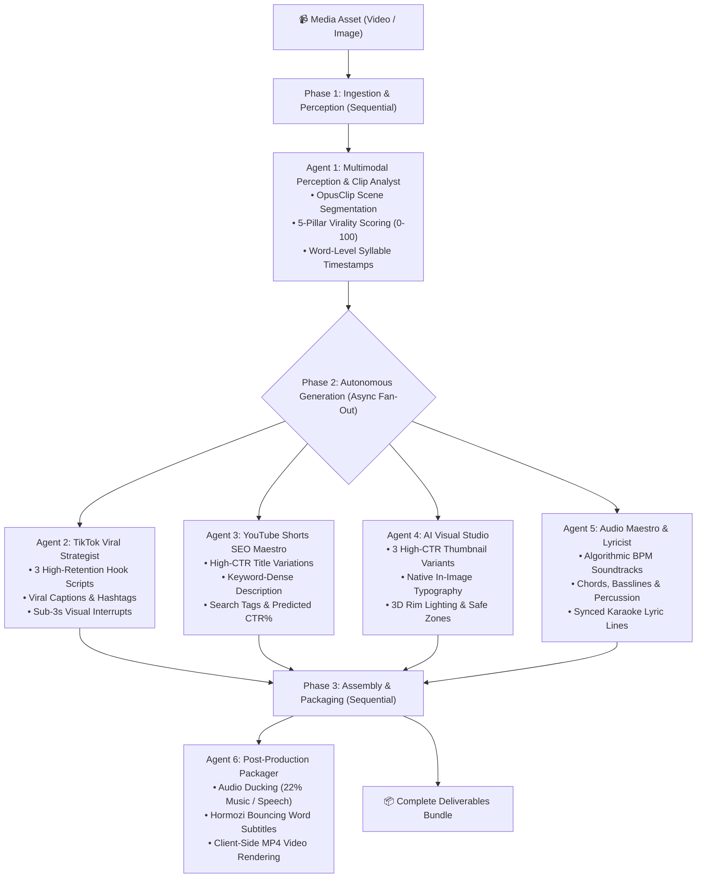

<div align="center">

# 🎬 CrewAI Media Pipeline Studio

**Autonomous 6-Agent Multimodal Media & Video Production Studio**  
*Powered by Google Gemini 3.7 / 3.5 & CrewAI Orchestration Architecture*

[](https://www.typescriptlang.org/)
[](https://react.dev/)
[](https://tailwindcss.com/)
[](https://ai.google.dev/)
[](https://vitest.dev/)

</div>

---

## 🌟 Overview

**CrewAI Media Pipeline Studio** is a full-stack media repurposing and content generation platform designed for short-form video creators across **TikTok, YouTube Shorts, and Instagram Reels**. 

Using a coordinated team of **6 autonomous AI agents**, it ingests raw footage or images, performs viral scene segmentation, composes BPM-synced soundtracks with karaoke lyrics, generates high-CTR thumbnails with in-image typography, creates platform-optimized copy, and renders full MP4 deliverables with burned-in **Hormozi-style animated subtitles**.

---

## 🤖 6-Agent Autonomous Architecture



---

## 🚀 Key Features

### 1. 📱 Multi-Platform Social Deliverables
- **TikTok Package**: Ready-to-copy captions, 0–3s on-screen pattern interrupts, call-to-actions, and curated hashtag pools.
- **YouTube Shorts SEO**: Title variations, keyword-dense descriptions with timestamp markers, search tags, and CTR predictions.
- **OpusClip Virality Scoring**: Multi-clip segmentation with 5-pillar breakdown (*Hook Strength*, *Visual Climax*, *Topic Novelty*, *Audio Sync*, *Loop Continuity*).

### 2. 🎨 High-CTR AI Thumbnail Studio
- 3 distinct psychological variant concepts (*Emotion/Face Climax*, *Minimal Punch 3-Second Rule*, *Story Dilemma & Curiosity Gap*).
- Native in-image 3D typography powered by `gemini-3-pro-image` with procedural vector fallback.
- YouTube duration badge bottom-right safe zone protection.

### 3. 🎵 Algorithmic Audio Synthesizer & Lyric Sync
- Web Audio API synthesizer generating BPM-matched chords, 808 sub-bass, arpeggios, and sidechained percussion.
- Word-level syllable timestamps powering synchronized bouncing lyric playback.
- Configurable audio ducking level (default: 22% background music volume).

### 4. 🎬 Client-Side Video Muxer & Subtitle Renderer
- In-browser Canvas + Web Audio MediaRecorder video muxer.
- Renders **Hormozi / Submagic** animated glowing subtitles with real-time syllable bounce.
- Automatic image-to-video zoom/pan animation (Ken Burns effect) for photo inputs.

### 5. 🧠 Prompt-to-Flow AI Architect
- Describe any media workflow in natural language and have Gemini generate a customized, runnable CrewAI DAG workflow with Python preview code.

### 6. 💾 Project Management & History
- Save, load, and export full studio project bundles.
- LocalStorage persistence with heavy media payload sanitization to prevent browser quota overflow.

---

## 🛠️ Tech Stack

- **Frontend**: React 19, TypeScript, Tailwind CSS, Lucide Icons, Canvas Confetti
- **Backend / Server**: Node.js, Express, Google GenAI SDK (`@google/genai`), Vite Middleware
- **AI Models Supported**:
  - `gemini-3.7-flash` (Default reasoning & perception)
  - `gemini-3.6-flash`
  - `gemini-3.5-flash` / `gemini-3.1-flash-lite`
  - `gemini-3.1-pro-preview`
  - `gemini-3-pro-image` (In-image typography & thumbnails)
- **Testing & Tooling**: Vitest, TypeScript compiler (`tsc --noEmit`), ESLint

---

## 🏁 Getting Started

### Prerequisites
- [Node.js](https://nodejs.org/) (v18 or higher recommended)
- A Google Gemini API Key (get one from [Google AI Studio](https://aistudio.google.com/))

### Installation

1. **Clone the repository:**
   ```bash
   git clone https://github.com/IamKenpachi/crewai-social-media-.git
   cd crewai-social-media-
   ```

2. **Install dependencies:**
   ```bash
   npm install
   ```

3. **Configure Environment:**
   Create a `.env` file in the root directory (or use `.env.example`):
   ```ini
   GEMINI_API_KEY=your_gemini_api_key_here
   PORT=3000
   ```

4. **Start the Development Server:**
   ```bash
   npm run dev
   ```
   Open [http://localhost:3000](http://localhost:3000) in your browser.

---

## 🧪 Testing & Validation

Run the Vitest test suite:
```bash
npm run test
```

Run TypeScript strict type checking:
```bash
npm run lint
```

Build production bundle:
```bash
npm run build
```

---

## 🐍 Standalone Python CLI Engine

Looking for a pure Python CLI tool that generates deliverables and renders final MP4 videos directly from your terminal? Check out the dedicated repository:
👉 [**social-media-engine-crewai**](https://github.com/IamKenpachi/social-media-engine-crewai)

---

## 📄 License

This project is licensed under the MIT License.
